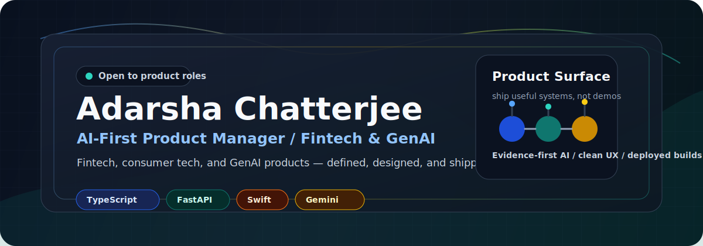

<div align="center">

<a href="https://lego-portfolio-ochre.vercel.app">
  
</a>

<br />


I define, design, and ship AI-first products — from 0-to-1 PRDs to deployed fintech, consumer tech, and GenAI workflows. I sit at the intersection of product judgment and technical execution so nothing gets lost in translation.

[](https://lego-portfolio-ochre.vercel.app)
[](https://www.linkedin.com/in/iamadarsha)
[](mailto:adarsha.chatterjee@gmail.com)
[](https://github.com/iamadarsha)

</div>

---

## PM Snapshot

| Signal | What I bring |
|---|---|
| AI-first product thinking | I spec, validate, and ship GenAI features — not just describe them. Evidence-cited AI, fallback chains, operator UX |
| Fintech & finance depth | Stock screeners, options strategy tooling, regulatory intelligence, compliance workflows, SEBI/RBI monitoring |
| Consumer tech intuition | Running shoe finder, restaurant OS, learning platforms — clear user problems, clean MVP surfaces |
| Technical ownership | I write the PRD *and* review the PR. Frontend, backend, AI pipeline, deployment — I close the loop |
| Shipping discipline | Live demos, documented user flows, GTM thinking, and product stories that recruiters and users both understand |

## What To Click First

| Product | PM lens |
|---|---|
| [FlowKeys](https://github.com/iamadarsha/FlowKeys) | Identified accessibility gap in macOS dictation for multilingual Indian users — scoped, built, and shipped natively |
| [LMS Platform](https://github.com/iamadarsha/LMS-Platform) | Designed full learning workflow — AI transcription, video intelligence, creator studio, and learner surfaces |
| [Compliance Intel](https://github.com/iamadarsha/Assignment) | Defined the product for regulatory AI: SEBI/RBI/MCA circulars with evidence-grounded, citation-first AI summaries |
| [BreakoutScan](https://github.com/iamadarsha/breakoutscan) | Fintech screener built for Indian retail traders — live data, scan engines, watchlists, and mobile-ready surfaces |
| [Portfolio](https://lego-portfolio-ochre.vercel.app) | The end-to-end product story tying all the work together |

## Featured Products

<table>
  <tr>
    <td width="50%">
      <a href="https://github.com/iamadarsha/FlowKeys">
        
      </a>
      <p><strong>Native macOS AI dictation</strong> — Hindi, English, and Hinglish with BYO-key AI providers. Zero cloud lock-in.</p>
    </td>
    <td width="50%">
      <a href="https://github.com/iamadarsha/LMS-Platform">
        
      </a>
      <p><strong>AI video learning platform</strong> — transcription, Gemini-powered content analysis, synced playback, and creator workflows.</p>
    </td>
  </tr>
  <tr>
    <td width="50%">
      <a href="https://github.com/iamadarsha/Assignment">
        
      </a>
      <p><strong>Fintech compliance intelligence</strong> — RBI, IFSCA, MCA, SEBI, FATF circulars with evidence-cited GenAI summaries.</p>
    </td>
    <td width="50%">
      <a href="https://github.com/iamadarsha/breakoutscan">
        
      </a>
      <p><strong>Indian market screener</strong> — live data, breakout scan engine, alerts, watchlists, and mobile-ready surfaces for retail traders.</p>
    </td>
  </tr>
  <tr>
    <td width="50%">
      <a href="https://github.com/iamadarsha/Shoe-Finder-App">
        
      </a>
      <p><strong>AI consumer recommendation engine</strong> — 260 running shoe models, 16 brands, fit-matched for Indian runners.</p>
    </td>
    <td width="50%">
      <a href="https://github.com/iamadarsha/Bhukkad">
        
      </a>
      <p><strong>Restaurant operator OS</strong> — POS, KOT, tablet ordering, inventory, reservations, and realtime outlet intelligence.</p>
    </td>
  </tr>
</table>

## Product Domains

```text
Fintech & Finance     Stock screeners, options strategy, compliance monitoring, regulatory AI, trading workflows
Consumer Tech         Recommendation engines, learning platforms, food-tech OS, productivity tools
GenAI Products        LLM pipelines, evidence-cited AI, prompt systems, transcription, fallback chains
Operator Tools        Internal dashboards, admin workflows, creator studios, job-search systems
```

## Technical Fluency

> I have enough depth to write the spec, review the PR, unblock the engineer, and deploy the demo — without needing a translator.

<div align="center">


</div>

```text
Frontend      React, Next.js, Vite, Tailwind CSS, shadcn/Radix UI, Framer Motion
Backend       FastAPI, Node.js, Next.js Route Handlers, REST APIs, WebSockets
Data          PostgreSQL, Supabase, Neon, SQLite, Redis, Drizzle ORM
AI/GenAI      Gemini, Groq, OpenAI/Codex, Claude, faster-whisper, prompt & workflow design
Infra         Vercel, Railway, Render, Docker, Cloudflare R2, Upstash
Product       PRDs, user research, MVP scoping, UX strategy, GTM thinking, product storytelling
```

## How I Work as a PM

- **Define clearly** — write PRDs that engineers can build from without a follow-up meeting
- **Prototype fast** — use GenAI tooling to validate ideas before committing engineering cycles
- **Ship end-to-end** — own the product from problem discovery to live deployment
- **Stay evidence-first** — no hallucinated features, no vibe-only specs; ground everything in user signal
- **Close the loop** — post-launch metrics, user feedback, and iteration are part of the job

## Current Focus

- Building AI-first fintech and consumer products with clear user value and live demos
- Improving GenAI product quality through evidence-cited answers, safer defaults, and better operator UX
- Deepening product intuition in finance, compliance, and trading intelligence workflows
- Positioning as an AI-first PM who can own the full product surface — strategy to shipped code

## GitHub Activity

<div align="center">


</div>

## Ask Me About

| Area | Examples |
|---|---|
| GenAI product design | LLM fallback chains, evidence-cited answers, transcription pipelines, recommendation systems |
| Fintech PM | Market screeners, compliance monitoring, options strategy tooling, regulatory intelligence |
| Consumer tech | Recommendation engines, food-tech OS, learning platforms, productivity apps |
| 0-to-1 shipping | Problem framing, MVP scoping, tech architecture, UX defaults, live deployment |

## Open To

AI-first Product Manager, GenAI Product Manager, and Technical PM roles in fintech, consumer tech, or AI infrastructure — where I can own ambiguous problems, define the right product, and ship it end-to-end.

## Contact

<div align="center">

[](https://lego-portfolio-ochre.vercel.app)
[](https://www.linkedin.com/in/iamadarsha)
[](mailto:adarsha.chatterjee@gmail.com)

</div>
